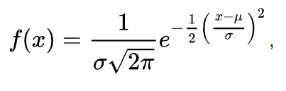

# Нормальное распределение

[Ссылка на википдию](https://ru.wikipedia.org/wiki/%D0%9D%D0%BE%D1%80%D0%BC%D0%B0%D0%BB%D1%8C%D0%BD%D0%BE%D0%B5_%D1%80%D0%B0%D1%81%D0%BF%D1%80%D0%B5%D0%B4%D0%B5%D0%BB%D0%B5%D0%BD%D0%B8%D0%B5)

Нормальное распределение, также называемое распределением Гаусса 
или Гаусса — Лапласа, или колоколообразная кривая — непрерывное 
распределение вероятностей с пиком в центре и симметричными боковыми 
сторонами, которое в одномерном случае задаётся функцией плотности 
вероятности, совпадающей с функцией Гаусса:



где параметр mu — математическое ожидание (среднее значение), 
медиана и мода распределения, а параметр sigma — среднеквадратическое 
отклонение, sigma^2 — дисперсия распределения.

**Стандартным нормальным распределением** называется нормальное 
распределение с математическим ожиданием mu = 0 и стандартным 
отклонением sigma = 1

#Numpy functions

### random.normal(loc=0.0, scale=1.0, size=None) 

используется для генерации случайных чисел из нормального 
распределения (также известного как гауссовское распределение). 
Нормальное распределение характеризуется своими параметрами: 
средним (mean) и стандартным отклонением (standard deviation).

- loc (среднее значение) - среднее значение нормального распределения. 
По умолчанию равно 0.0.
- scale (стандартное отклонение) - стандартное отклонение нормального 
  распределения. По умолчанию равно 1.0.
- size (размер) - размер возвращаемого массива случайных чисел. 
  Если параметр не указан, возвращается одно случайное число. 
  Если указано целое число, возвращается одномерный массив заданного 
  размера. Если указан кортеж целых чисел, возвращается массив с 
  размерами, указанными в кортеже.

### numpy.hstack(tup, *, dtype=None, casting='same_kind')

Функция np.hstack() в библиотеке NumPy используется для 
горизонтальной (по горизонтали) конкатенации массивов. Она 
объединяет массивы по горизонтали, то есть добавляет элементы 
одного массива в конец другого массива вдоль второй оси массива.

```python
# Создание двух массивов
array1 = np.array([1, 2, 3])
array2 = np.array([4, 5, 6])

# Горизонтальная конкатенация
result = np.hstack((array1, array2))

# result = [1 2 3 4 5 6]
```

### numpy.vstack(tup, *, dtype=None, casting='same_kind')

Функция np.vstack() в библиотеке NumPy используется для вертикальной 
(по вертикали) конкатенации массивов. Она объединяет массивы по 
вертикали, то есть добавляет элементы одного массива под другой 
массив вдоль первой оси массива.

```python
# Создание двух массивов
array1 = np.array([[1, 2, 3],
                   [4, 5, 6]])

array2 = np.array([[7, 8, 9],
                   [10, 11, 12]])

# Вертикальная конкатенация
result = np.vstack((array1, array2))

# result = 
# [[ 1  2  3]
# [ 4  5  6]
# [ 7  8  9]
# [10 11 12]]
```


### ravel()


Функция ravel() в библиотеке NumPy используется для преобразования 
многомерного массива в одномерный массив. Она "выпрямляет" массив, 
то есть превращает все его элементы в одномерную последовательность, 
располагая их в порядке, соответствующем последовательному проходу по 
каждой размерности исходного массива.

```python
# Предположим, что Y0 и Y1 - это некоторые массивы
Y0 = np.array([[1, 2, 3],
               [4, 5, 6]])

Y1 = np.array([[7, 8, 9],
               [10, 11, 12]])

# Вертикальная конкатенация и преобразование в одномерный массив
result = np.vstack((Y0, Y1)).ravel()

# result = [ 1  2  3  4  5  6  7  8  9 10 11 12]
```

### numpy.random.default_rng(seed=None)

Функция np.random.default_rng() в библиотеке NumPy создает новый 
генератор случайных чисел (RNG) на основе класса default_rng, 
который представляет собой новый способ генерации случайных чисел, 
введенный в NumPy версии 1.17.

Этот генератор случайных чисел является "использованием 
идентификатора генератора" (англ. generator-identifier), который 
гарантирует воспроизводимость последовательности случайных чисел
при повторном запуске программы. Таким образом, если у вас есть 
идентичные параметры, генератор будет возвращать одни и те же 
случайные числа при каждом запуске.

### numpy.arange([start, ]stop, [step, ]dtype=None, *, like=None)

Функция np.arange() в библиотеке NumPy создает одномерный массив с 
последовательностью чисел в указанном диапазоне. Она подобна 
встроенной функции range() в Python, но возвращает массив 
вместо итератора.

- start (начало) - необязательный параметр, определяющий начальное значение последовательности. По умолчанию равен 0.
- stop (конец) - обязательный параметр, определяющий конечное значение последовательности (не включительно).
- step (шаг) - необязательный параметр, определяющий шаг между последовательными числами. По умолчанию равен 1.
- dtype - необязательный параметр, определяющий тип данных элементов массива. Если не указан, тип будет определен на основе других параметров.

